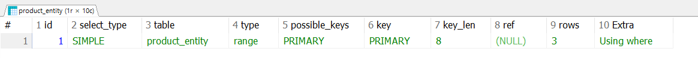

# 2026-09-08

## 🟢 WHERE SEQ IN은 어떤 순서대로 락이 걸릴까?

처음에는 `IN` 절에 `seq`가 들어온 순서대로 락이 걸린다고 생각했다.

하지만 실제로는 `IN` 절에 값을 작성한 순서가 아니라, **DB의 실행 계획과 실제 레코드 접근 순서**에 영향을 받는다.

예를 들어 `product_seq`가 PK이고 DB가 PK 인덱스를 이용해 스캔한다면 `1 → 2 → 3`과 같은 순서로 레코드에 접근할 수 있다.

하지만 단순히 다음과 같이 작성했다고 해서

```sql
WHERE product_seq IN (1, 2, 3)
```

항상 `1 → 2 → 3` 순서로 접근하고 락을 획득한다고 보장할 수는 없다.

만약 서로 다른 트랜잭션이 여러 상품의 락을 서로 다른 순서로 획득한다면 **데드락(Deadlock)**이 발생할 가능성이 있다.

예를 들어 다음과 같은 상황이다.

```text
주문 A : 1번 락 획득 → 2번 락 대기
주문 B : 2번 락 획득 → 1번 락 대기
```

A는 B가 가진 2번 락을 기다리고, B는 A가 가진 1번 락을 기다리기 때문에 서로 진행하지 못한다.

따라서 여러 레코드에 락을 걸 때는 **가능한 한 항상 동일한 순서로 레코드에 접근하도록 설계하는 것이 중요하다.**

애플리케이션에서 `seq`를 정렬하고, 쿼리에서도 다음과 같이 `ORDER BY`를 사용해 일관된 접근 순서를 유도할 수 있다.

```sql
SELECT *
FROM product_entity
WHERE product_seq IN (1, 2, 3)
ORDER BY product_seq ASC
FOR UPDATE;
```

다만 `ORDER BY`는 기본적으로 **결과의 반환 순서를 보장하는 것**이지, 모든 상황에서 DB 내부의 락 획득 순서까지 절대적으로 보장한다는 의미는 아니다.

따라서 실제 실행 계획도 함께 확인해야 한다.

```sql
EXPLAIN
SELECT *
FROM product_entity
WHERE product_seq IN (1, 2, 3)
ORDER BY product_seq ASC
FOR UPDATE;
```



`Extra`에서 `Using filesort`가 나타난다면 DB가 별도의 정렬 작업을 수행하고 있다는 의미이다.

반대로 PK 인덱스를 이용해 원하는 순서대로 접근하고 별도의 정렬 작업이 필요하지 않다면 `Using filesort`가 나타나지 않을 수 있다.

즉, 현재 구조에서는 다음과 같은 방향으로 데드락 가능성을 줄일 수 있다.

```text
애플리케이션에서 seq 정렬
        ↓
PK 컬럼 기준 ORDER BY
        ↓
실행 계획(EXPLAIN) 확인
        ↓
가능한 한 모든 트랜잭션이 동일한 순서로 레코드 접근
```

---

## 🔵 Pessimistic Lock

동시성 문제를 해결하기 위해 처음에는 특별한 기준 없이 `Pessimistic Lock`을 선택했다.

하지만 공부해 보니 낙관적 락은 충돌을 감지한 이후 재시도 등의 로직을 추가로 설계해야 하는 반면, 비관적 락은 **조회 시점부터 DB의 락을 이용해 다른 트랜잭션의 접근을 대기시킬 수 있다.**

따라서 현재 구현 중인 **재고 차감의 동시성 문제를 비교적 단순하게 해결할 수 있었다.**

Spring Data JPA에서는 다음과 같이 사용할 수 있다.

```java
@Lock(LockModeType.PESSIMISTIC_WRITE)
List<ProductEntity> findByProductSeqInOrderByProductSeqAsc(List<Long> seqs);
```

처음에는 `PESSIMISTIC_WRITE`라는 이름 때문에 UPDATE를 수행할 때 락을 거는 방식이라고 생각했다.

하지만 실제로는 **SELECT로 데이터를 조회하는 시점에 락을 획득하는 방식**이다.

DB에서는 대략 다음과 같은 쿼리로 실행된다.

```sql
SELECT *
FROM product
WHERE product_seq IN (?)
ORDER BY product_seq ASC
FOR UPDATE;
```

여기서 `FOR UPDATE`는

> "이 레코드를 이후에 변경할 예정이므로 현재 트랜잭션이 끝날 때까지 다른 트랜잭션이 충돌하는 락을 획득하지 못하도록 잠가두겠다."

정도로 이해할 수 있다.

락은 `SELECT ... FOR UPDATE`가 실행되어 레코드 락을 획득한 시점부터 트랜잭션이 `COMMIT` 또는 `ROLLBACK`될 때까지 유지된다.

따라서 트랜잭션 안에 외부 API 호출처럼 오래 걸리는 작업이 포함되면 **트랜잭션 시간과 락 점유 시간도 길어질 수 있다.**

---

## 🟢 외부 API 호출과 트랜잭션을 분리하면 되지 않을까?

그렇다면 외부 API 호출과 DB 작업을 다음과 같이 분리하면 될 것이라고 생각했다.

```java
public void insertOrders(...) {
    callExternalApi();     // 외부 API 호출
    processOrder(...);     // @Transactional 메서드
}

@Transactional
public void processOrder(...) {
    // 락 조회 + 재고 차감 + 저장
}
```

하지만 같은 클래스 안에서 이렇게 호출하면 원하는 방식으로 동작하지 않을 수 있다.

그 이유는 Spring의 `@Transactional`이 **프록시 기반 AOP**로 동작하기 때문이다.

---

## 🟢 @Transactional은 프록시 기반 AOP

Spring이 관리하는 객체의 `@Transactional` 메서드를 외부에서 호출하면 실제 객체를 바로 호출하는 것이 아니라, Spring이 만든 Proxy를 거쳐 호출된다.

```text
Controller
    ↓
Proxy
    ↓
OrderService
```

Proxy는 호출을 가로채 `@Transactional`이 붙어 있는지 확인하고 다음과 같은 작업을 수행한다.

```text
트랜잭션 시작
    ↓
메서드 실행
    ↓
COMMIT / ROLLBACK
```

문제는 같은 클래스 내부에서 다른 메서드를 호출하는 경우이다.

```java
public void insertOrders(...) {
    callExternalApi();
    processOrder(...);
}
```

이때 `processOrder()`는 사실상 다음과 같이 현재 객체 내부에서 호출된다.

```java
this.processOrder(...);
```

따라서 호출 구조는 다음과 같다.

```text
Controller
    ↓
Proxy
    ↓
OrderService.insertOrders()
             ↓
      this.processOrder()
```

`processOrder()`를 호출할 때 **Proxy를 다시 거치지 않고 실제 객체 내부에서 직접 호출**하게 된다.

Spring의 `@Transactional`은 Proxy가 메서드 호출을 가로챌 때 트랜잭션을 시작하기 때문에, 이러한 self-invocation에서는 `processOrder()`의 `@Transactional`이 기대한 대로 적용되지 않는다.

따라서 트랜잭션을 담당하는 로직을 별도의 Spring Bean으로 분리하는 방법을 사용할 수 있다.

```text
Controller
    ↓
OrderService
    │
    ├─ 외부 API 호출
    │
    ↓
OrderTransactionService Proxy
    ↓
@Transactional processOrder()
    ↓
락 조회 + 재고 차감 + 주문 저장
    ↓
COMMIT
```

이렇게 하면 외부 API를 호출하는 동안에는 DB 트랜잭션과 락을 유지하지 않고, 실제 DB 작업이 필요한 구간에서만 트랜잭션을 시작할 수 있다.
