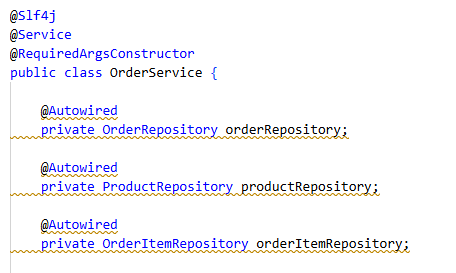

# 2026-09-17

## 생성자를 만들 때 왜 final를 작성해야할까?

처음에 개발할 때, 생성자 주입을 위해서 `@Autowired`로 작성했다.

근데 아래와 같이 노란색 줄이 발생헀다.

오류는 아니지만, 경고하는 줄으로서 잘 작성했다고 생각했는데, 왜 이렇게 나오는 지 궁금해졌다.



테스트 및 실행은 잘 진행되었다.

Spring이 빈(bean) 하나를 만들 때는 아래와 같은 과정을 거친다.

```
1. 인스턴스 생성 (생성자 호출)
2. 의존성 주입 (필드/세터 채우기)
3. 초기화 콜백
```

이 때 `@Autowired`는 2번 단계에서 주입(필드 주입)을 진행하고, `@RequiredArgsConstructor` 는 1번 단계에서 주입(생성자 주입)이 일어난다.

```java
@Autowired
private ProductRepository productRepository;
```

더 자세하게 설명하자면, Spring이 객체를 먼저 만든 다음(기본 생성자 또는 존재하는 아무 생성자로), 리플렉션 (Field.set(...))을 이용해서 필드에 직접 값을 넣는 방식이다.`RequiredArgsConstructor`

반면, `@RequriedArgsConstructor`은 컴파일 시점에 실제 생성자를 만들어준다.

```java
public OrderService(OrderRepository orderRepository, ...) {
    this.orderRepository = orderRepository;
    ...
}
```

그렇다면, **주입하지 못했을 때는 어떤 일이 발생할까?**

```
{
    "timestamp": "2026-09-17T01:10:45.373Z",
    "status": 500,
    "error": "Internal Server Error",
    "trace": "java.lang.NullPointerException: Cannot invoke ...
    "message": "Cannot invoke \"com.truthgarnet.shopping.product.ProductRepository.findByProductSeqInOrderByProductSeqAsc(java.util.List)\" because \"this.productRepository\" is null",
    "path": "/orders"
}
```

`this.productRepository\" is null",` 의 오류를 통해서 의존성 주입이 실패한 것을 알 수 있다.

그렇다면 본론으로 다시 돌아와서

`@RequreidArgsConstructor`은 왜 private final에 주입을 하게 되는 걸까?

주입하는 순서를 확인하면 알게 된다.

순수 Java에서

```java
public class Foo {
    public Foo(String name) {   // (A) 생성자 "정의"
        this.name = name;
    }
}

Foo f = new Foo("hello");   // (B) 생성자 "호출"
```

컴파일러가 Foo를 .class 파일 안에 "Foo 생성자가 있다"라고 정보를 담아둔다.`

**프로그렘이 실행** 되면서 실제로 Foo라는 객체를 메모리에 만들고, "hello"라는 진짜 값을 그 생성자 안에 담아주듯

```java
@Slf4j
@Service
@RequiredArgsConstructor
public class OrderService {

    private final OrderRepository orderRepository;
    private final ProductRepository productRepository;
    private final OrderItemRepository orderItemRepository;

    ...
}
```


`@RequiredArgsConstructor`는 **필수 필드를 파라미터로 받는 생성자를 만들어주는 Lombok 어노테이션**이다.

여기서 필수 필드에는 `final`이 붙은 필드와 Lombok의 `@NonNull`이 붙은 필드가 포함된다.

따라서 의존성 필드에 `final`을 선언하면 `@RequiredArgsConstructor`가 해당 필드를 생성자의 파라미터에 포함시킨다.

```java
@RequiredArgsConstructor
public class OrderService {

    private final OrderRepository orderRepository;
    private final ProductRepository productRepository;
}
```

위 코드는 컴파일 시점에 다음과 같은 생성자가 만들어진다.

```java
public OrderService(
        OrderRepository orderRepository,
        ProductRepository productRepository
) {
    this.orderRepository = orderRepository;
    this.productRepository = productRepository;
}
```

반대로 `final`이나 Lombok의 `@NonNull`이 붙은 필드가 하나도 없다면 생성자에 포함할 필수 필드가 없기 때문에 인자가 없는 생성자가 만들어진다.
